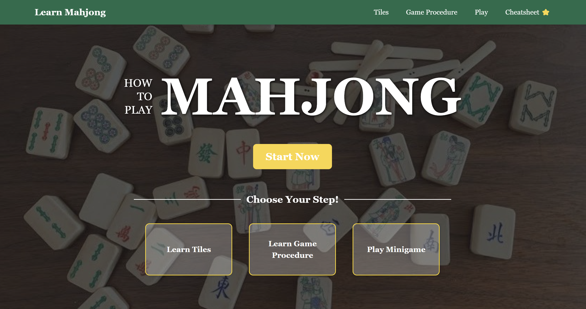

# How to Play Mahjong – Interactive Learning App 🀄

This web app helps users learn Mahjong through interactive steps including visual tutorials, drag-and-drop matching quizzes, and a minigame.


## Features

- Learn about **melds**, **pairs**, and how to form a **winning hand**
- Rearrange tiles to reinforce structure recognition
- Hover & click to reveal **visual explanations**
- Play drag-to-match quizzes with **immediate feedback**
- Save examples to your own **cheatsheet modal** for review

## Tech Stack

- **Python / Flask** (backend)
- **HTML** templating
- **CSS** + **Bootstrap**
- **JavaScript** (drag-and-drop, modals, dynamic feedback)

## How to Run

1. **Clone the repo:**
```bash
   git clone https://github.com/dby516/UIDesign_project.git
```  
2. **Navigate to the project folder. Start the server by running:**

```bash
   python app.py
```
3. **Open your browser and visit: http://127.0.0.1:5000**
